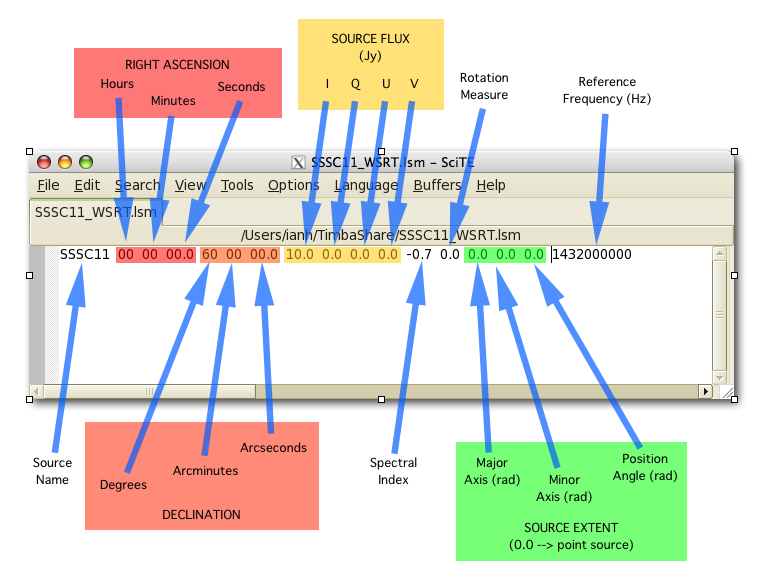

======
Inputs
======

MeqSilhouette accepts as inputs various telescope, sky, and observation parameters in different formats. The master input file is a JSON parset containing many input parameters. Sample input files and settings can be found in the *input* subdirectory. Each input file type is explained in detail below.

JSON parset file
################

The input parset file is in JSON format with parameters that are loosely grouped into the following sets:

*    General I/O parameters
*    Measurement Set (MS) parameters (prefixed *ms_*)
*    Imaging parameters (prefixed *im_*)
*    Tropospheric parameters (prefixed *trop_*)
*    Antenna pointing error parameters (prefixed *pointing_*)
*    Bandpass corruption parameters (prefixed *bandpass_*)

Any relative paths are assumed to be relative to MEQS_DIR.

.. list-table:: Parameters in JSON parset file
   :widths: 60 60 60 500
   :header-rows: 1

   * - Parameter
     - Type
     - Units
     - Explanation
   * - *outdirname* 
     - string
     - 
     - Output directory with absolute or relative path. Must be writable.
   * - *input_fitsimage*
     - string
     - 
     - Directory containing sky models in FITS image format or ASCII/Tigger-LSM file containing the source list with absolute or relative path. See :ref:`sky-models`.
   * - *input_fitspol*
     - bool
     - 
     - Indicate that the FITS sky models are polarised. Used only when *input_fitsimage* is a directory containing FITS sky models.
   * - *input_changroups*
     - int
     - 
     - The number of groups into which the total number of frequency channels must be divided. Used only when *input_fitsimage* is a directory containing FITS sky models. Must be equal to the number of frequencies for which the FITS files are present.
   * - *output_to_logfile*
     - bool
     - 
     - Write output messages to logfile instead of to the terminal.
   * - *add_thermal_noise*
     - bool
     - 
     - Add baseline-dependent thermal noise, calculated using station SEFDs obtained from *station_info* file.
   * - *exportuvfits*
     - bool
     - 
     - Export MS to UVFITS format.
   * - *station_info*
     - string
     - 
     - Name of the file containing individual station information such as SEFD, coherence time, primary beam model etc., with absolute or relative path. See :ref:`station-info`.
   * - *bandpass_enabled*
     - bool
     - 
     - Add complex bandpass corruptions.
   * - *bandpass_table*
     - string
     - 
     - Name of the ASCII file containing bandpass gain amplitudes for each station for a set of frequencies with absolute or relative path. Each line consists of the station name and a string containing the bandpass amplitude for both polarisations in the format *(bpass_ampl_pol1, bpass_ampl_pol2)* for each representative frequency. Each column represents a frequency value in GHz. The phases are generated randomly between -30 and +30 degrees.
   * - *bandpass_freq_interp_order*
     - int
     - 
     - Order of spline interpolation. Integer between 1 and 5.
   * - *bandpass_makeplots*
     - bool
     - 
     - Generate bandpass plots.
   * - *elevation_limit*
     - double
     - *radians*
     - Flag visibilities below this elevation limit.
   * - *corr_quantbits*
     - int
     - 
     - Number of bits used for quantisation by the correlator (e.g. 2 for four levels). Used to compute correlator efficiency.
   * - *predict_oversampling*
     - int
     - 
     - Oversampling factor to improve the accuracy of forward modelling with *WSClean*. Must be an odd number (e.g. 8191).
   * - *predict_seed*
     - int
     - 
     - Seed for random number generation with numpy. Set to -1 will disable seeding.
   * - *ms_antenna_table*
     - string
     - 
     - Name of *CASA* ANTENNA table to use for creating the MS, with absolute or relative path.
   * - *ms_datacolumn*
     - string
     - 
     - Name of the MS column to write the output visibilities to. Commonly used values are 'DATA', 'CORRECTED_DATA', or 'MODEL_DATA'.
   * - *ms_RA*
     - double
     - *degrees*
     - Right Ascension of the pointing centre of the observation.
   * - *ms_DEC*
     - double
     - *degrees*
     - Declination of the pointing centre of the observation.
   * - *ms_polproducts*
     - string
     - 
     - Specify the polarisation feed type in *CASA* recognisable format (e.g. 'RR RL LR LL' or 'XX XY YX YY').
   * - *ms_nu*
     - double
     - *GHz*
     - Centre frequency of the bandpass.
   * - *ms_dnu*
     - double
     - *GHz*
     - Bandwidth of the spectral window.
   * - *ms_nchan*
     - int
     - 
     - Number of channels. 
   * - *ms_obslength*
     - double
     - *hours*
     - Duration of the observation.
   * - *ms_tint*
     - double
     - *seconds*
     - Integration time.
   * - *ms_StartTime*
     - string
     - 
     - Starting time of the observation (e.g. 'UTC,2017/04/01/00:00:00.00').
   * - *ms_nscan*
     - int
     -
     - Number of scans in the observation.
   * - *ms_scan_lag*
     - double
     - *hours*
     - DEPRECATED. Left intact for backward compatibility.
   * - *ms_makeplots*
     - bool
     - 
     - Generate plots of the data such as uv-coverage and uv-distance sensitivity bins.
   * - *ms_correctCASAoffset*
     - bool
     - 
     - In a two-step process, correct for the spurious offset introduced by CASA to the start-time of the observation. Simulate an MS of the same duration as the required observation (but with a much longer integration time) to calculate this offset and adjust the start-time by this value to create an MS that starts at the required time.
   * - *make_image*
     - bool
     - 
     - Make dirty image using lwimager. The *im_* parameters are used only when this parameter is *True*.
   * - *im_cellsize*
     - multi
     - 
     - Cell size to be used for imaging with units (e.g. '3e-6arcsec').
   * - *im_npix*
     - int
     - *pixels*
     - Image size.
   * - *im_stokes*
     - string
     - 
     - Stokes parameter to image. Allowed values are 'I', 'Q', 'U', or 'V'.
   * - *im_weight*
     - string
     - 
     - Weighting scheme to use for imaging. Allowed values are 'uniform', 'natural', or 'briggs'.
   * - *trop_enabled*
     - bool
     - 
     - Enable corruptions by the troposphere. The other *trop_* parameters are used only when this parameter is *True*.
   * - *trop_wetonly*
     - bool
     - 
     - Simulate only the wet component (i.e. the component due to water vapour).
   * - *trop_attenuate*
     - bool
     - 
     - Enable attenuation by the troposphere.
   * - *trop_noise*
     - bool
     - 
     - Include sky noise from the troposphere.
   * - *trop_turbulence*
     - bool
     -
     - Add Kolmogorov turbulence to the simulated visibility phases.
   * - *trop_mean_delay*
     - bool
     -
     - Add mean (i.e. non-turbulent) delays due to the mean tropospheric component (both dry and wet).
   * - *trop_percentage_calibration_error*
     - float
     -
     - DEPRECATED. Left intact for backward compatibility.
   * - *trop_fixdelays*
     - bool
     - 
     - Insert time-invariant delays computed by taking the mean over the spectral window.
   * - *trop_fixdelay_max_picosec*
     - int
     - *picoseconds*
     - DEPRECATED. Maximum absolute value of the constant delays generated when *trop_fixdelays=True* in picoseconds. Used mainly for testing specific calibration experiments such as fringe-fitting. Regardless of the value of this parameter, the delays are computed by averaging over a spectral window.
   * - *trop_makeplots*
     - bool
     - 
     - Generate troposphere-related plots such as zenith opacity, elevation-dependent transmission, zenith sky temperature, and turbulent phase errors and delays.
   * - *pointing_enabled*
     - bool
     - 
     - Enable pointing errors. The other *pointing_* parameters are used only when this parameters is *True*.
   * - *pointing_time_per_mispoint*
     - float
     - *minutes*
     - Generate new pointing error per station every this minute.
   * - *pointing_makeplots*
     - bool
     - 
     - Generate pointing offset-related plots.
   * - *uvjones_g_on*
     - bool
     - 
     - Add time-varying station-based complex gains (G-Jones). The per-station values to be used to generate the gains are read from the *station_info* file.
   * - *uvjones_d_on*
     - bool
     - 
     - Add instrumental polarisation. Polarisation leakage (D-Jones) and parallactic angle rotation (P-Jones) are added. The per-station values to be used to generate the leakage values are read from the *station_info* file.
   * - *parang_corrected*
     - bool
     - 
     - Indicate if the correction for parallactic angle rotation has already been made. If True, rotate the visibilities by twice the field angle. If False, perform parallactic angle rotation correction before introducing polarisation leakage (D-Jones) (`Leppanen et al. 1995 <https://ui.adsabs.harvard.edu/abs/1995AJ....110.2479L/abstract>`_).

.. note:: Ensure that *ms_nchan* != 1 when *trop_enabled* = True. AATM may fail while when there is only one frequency channel present in the MS. If only one (e.g. averaged) frequency channel is desired, the tropospheric corruptions must be calculated at a higher frequency resolution and the channels manually averaged at the end of the simulation run.

.. _sky-models:

Sky models
##########
The parameter *input_fitsimage* points to sky models in two formats that are recognisable by MeqSilhouette.

FITS format
-----------
Sky models in FITS formats are forward-modelled using *WSClean* under the hood. The directory pointed to by *input_fitsimage* must contain all FITS files that constitute the sky model.
The following naming convention applies to the individual FITS files:

* If there is no time-variability or polarisation, then *input_fitsimage* contains only one FITS image named *t0000-model.fits*.

* If the sky model is time-variable, the FITS files named *txxxx-model.fits*, where xxxx=0000, 0001, ... . The total number of unique times in the MS are divided evenly into N groups, where N is the number of times for which FITS files are present.

* If the sky model is polarised, the FITS images are named *txxxx-[IQUV]-model.fits*, representing each Stokes component [I, Q, U, V]. All Stokes components must be present for each time and frequency.

* If the sky model is frequency-variable, the FITS files are named *t0000-yyyy-model.fits*, where yyyy=0000, 0001, ... . The number of frequencies must be equal to *input_changroups*.

Following *WSClean*, MeqSilhouette does not care about the actual frequencies in the FITS headers. This means that the input channels in the MS will be divided evenly into *input_changroups* groups
and each FITS image along the frequency axis will be used to predict visibilities into the appropriate group, regardless of the frequencies in the FITS headers.

Putting all of the above together, a time and frequency varible polarised sky model will consist of a series of FITS files named *txxxx-yyyy-[I,Q,U,V]-model.fits*,
where xxxx=0000, 0001, .... (as many as needed to replicate intrinsic source variability) and yyyy=0000, 0001, .... (must be equal to *input_changroups*).

.. note:: *WSClean* can predict visibilities only into the MODEL_DATA column. MeqSilhouette will copy them into *ms_datacolumn*, after which the signal corruptions are applied only to *ms_datacolumn*. Hence, the uncorrupted visibilities are available in MODEL_DATA column for inspection.

ASCII / Tigger LSM format
-------------------------
The ASCII / Tigger LSM file with extensions *.txt* / *.lsm.html* respectively, are sky model files recognisable by the *tigger-lsm* module used by *MeqTrees*. This file contains a list of sources, with each row corresponding to one source. The columns are as shown in the figure below:

.. note:: It is recommended to use FITS images as inputs (in which case *WSClean* is used for predicting visibilities). MeqTrees has been observed to occasionally give rise to precision errors of up to ~1 micro-arcsecond. Hence, when using ASCII / Tigger LSM files, additional sanity checks must be performed to ensure that the source positions are not offset from the expected values. This is an outstanding issue with MeqTrees and will be resolved in a future version.

.. _station-info:

Station and site information
############################

The parameter *station_info* points to an ASCII file containing additional information about the
participating stations and the site weather parameters for generating the Jones matrices for corrupting the visibilities.
Each row corresponds to one station. The details of each column are given below.

.. list-table:: Station and site information
   :widths: 60 60 60 500
   :header-rows: 1

   * - Column
     - Type
     - Units
     - Explanation
   * - station 
     - string
     - 
     - Station name or code.
   * - sefd
     - float
     - Jansky
     - System Equivalent Flux Density.
   * - pwv
     - float
     - millimetres
     - Precipitable water vapour.
   * - gpress
     - float
     - millibar
     - Ground pressure at site.
   * - gtemp
     - float
     - Kelvin
     - Ground temperature at site.
   * - c_time
     - float
     - seconds
     - Tropospheric coherence time.
   * - ptg_rms
     - float
     - arcseconds
     - RMS error in pointing.
   * - PB_FWHM230
     - float
     - arcseconds
     - Full Width at Half-Maximum of the primary beam.
   * - PB_model
     - string
     - 
     - Geometric model to be used for the primary beam ('gaussian' and 'cos3' are available; hardwired to *gaussian* for now).
   * - ap_eff
     - float
     - 
     - Aperture efficiency.
   * - g[RL]_mean, g[RL]_std
     - float
     - 
     - Mean and standard deviation of the normal distribution from which to draw time-varying real/imag parts of the G-Jones terms for R and L feeds.
   * - d[RL]_mean, d[RL]_std
     - float
     - 
     - Mean and standard deviation of the normal distribution from which to draw frequency-varying real/imag parts of the D-Jones terms for R and L feeds.
   * - feed_angle
     - float
     - degrees
     - Initial feed angle offset.
   * - mount
     - string
     - 
     - Mount type of each station. Valid values are 'ALT-AZ', 'ALT-AZ+NASMYTH-R', 'ALT-AZ+NASMYTH-L'.
